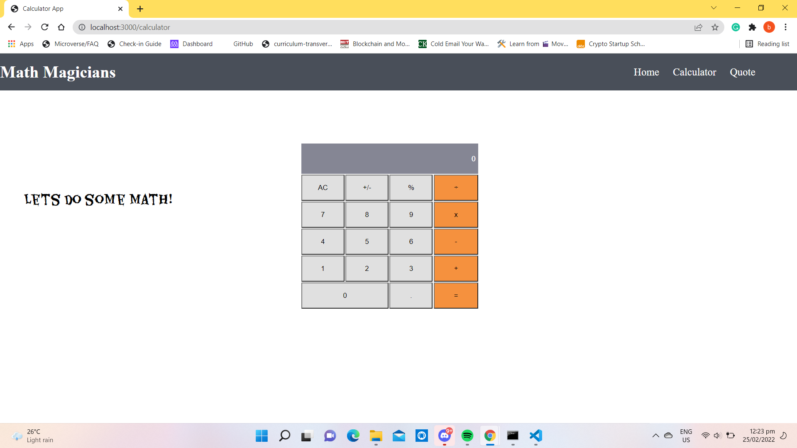

# Math Magicians

> Math magicians is a website for all fans of mathematics. It is a Single Page App (SPA) that allows users to make simple calculations and Read a random math-related quote.

## Built With

- HTML
- CSS
- JavaScript
- React

## How to use and run this project

>To get a local copy up and running follow these simple example steps.

- Clone this repository with

git clone https://github.com/butlermuwo/math-magians.git using your terminal or command line.

- Change to the project directory by entering :

cd math-magians in the terminal.

- run code . to open it in vscode
- Install packages using the command npm install
- run the project locally by entering the command npm start

## Project Status
This project is in progress.

## Screenshoots

## Live Demo()
[Live Demo Link](https://unruffled-payne-458b03.netlify.app/)
## Authors

👤 **Author1**

- GitHub: [@ButlerMuwo](https://github.com/butlermuwo)
- Twitter: [@ButlerMuwo](https://twitter.com/ButlerMuwo)
- LinkedIn: [@ButlerMuwo](https://www.linkedin.com/in/butler-shimaluwani-41a680159/)

## 🤝 Contributing

Contributions, issues, and feature requests are welcome!

Feel free to check the [issues page](https://github.com/butlermuwo/math-magians/issues).

## Show your support

Give a ⭐️ if you like this project!

## Acknowledgments

- Thanks to everyone that helping
## 📝 License

This project is [MIT](./MIT.md) licensed.